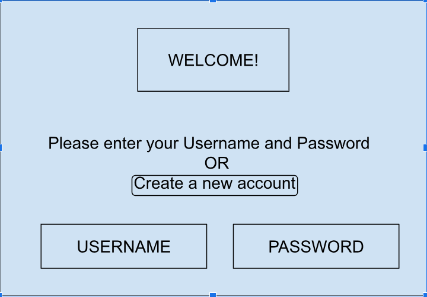

# Software Requirements Specification for Personal Studying Scheduling Application

	Version 1.1 approved

	Prepared by Vincent Serrano, Zuxin Chen, Brian Espinoza Lozano

	Farmingdale State College

	9/23/2023
## Table of Contents

Table of Contents	ii

Revision History	ii

1.	Introduction	

  	1.1	Purpose	

  	1.2	Document Conventions	
	
 	1.3	Intended Audience and Reading Suggestions	
	
 	1.4	Product Scope	

2.	Overall Description	
	
 	2.1	Product Perspective	
	
 	2.2	Product Functions	
	
 	2.3	User Classes and Characteristics	
	
 	2.4	Operating Environment	
	
 	2.5	Design and Implementation Constraints	
	
 	2.6	User Documentation	
	
 	2.7	Assumptions and Dependencies	

4.	External Interface Requirements	
	
 	3.1	User Interfaces	
	
 	3.2	Hardware Interfaces	
	
 	3.3	Software Interfaces	
	
 	3.4	Communications Interfaces	
5.	System Features	
	
 	4.1 Add an Event
	
 	4.2 Add Recurring Event

    4.3 User Preferences

    4.4 Set topics

    4.5 Login

    4.6 Create an Account

6.	Other Nonfunctional Requirements	
	
 	5.1	Performance Requirements	
	
 	5.2	Safety Requirements	

 	5.3	Security Requirements	
	
 	5.4	Software Quality Attributes	
	
 	5.5	Business Rules	
7.	Other Requirements	

    Appendix A: Glossary	

## Revision History
| Name		      | Date		     | Reason For Changes	 | Version |
|-------------|------------|---------------------|---------|
| Zuxinchen 	 | 9/28/2023	 | change format		     | 1.1     |
| ZuXinchen   | 10/1/20223 | Complete 1 and 2	   | 1.1     |
| Vincent	    | 10/1/2023	 | Edits			            | 1.1     |

## 1.	Introduction
	
1.1	Purpose 

	The purpose of this document is to present a detailed description of the Personal Studying Scheduling Application.
	It will explain the purpose and features of the software, the interfaces of the software, what the software will do, 
 	and the constraints under which it must operate. This document is intended for users of the software and also potential developers.

1.2	Document Conventions

	This Document was created based on the IEEE template for System Requirement Specification Documents.

1.3	Intended Audience and Reading Suggestions

	~Typical users, made for students who would like to use the application to better schedule their time for studying.
	~Programmers that would like to implement changes to the code to improve the program to suit their needs better.

1.4	Product Scope

 	This software will be a personal scheduling system that is made for students who would to optimize
  	their efficiency by allowing the software to allocate time based on their schedule for the student to study. By doing so
   	it allows the users of the program to sufficiently allow for time to learn and retain their material
    better.

## 2.	Overall Description

2.1	Product Perspective

	The program is designed to be used by anyone who would like to better optimize and schedule their time
 	by using our software to automatically allocate time to study different topics. The program was developed
  	to be used on Windows, Mac OS X, and Linux.
 
2.2	Product Functions

	Login - Allows the user to log in to their account.
 
 	Create an Account - Allows the user to create a new account.
  
  	Create an Event - Allows the user to create a singular event on the schedule. Takes the time, duration, and date of the event.
   
   	Create a Recurring Event - Allows the user to create a recurring event on the schedule. Takes the time of the event, days, 
    duration, and how long the recurring event will last(The end date of the event).
     
    Set Study Topics - Allows the user to set topics they would like to study for along with the amount of time they
    would like to study this topic per week and duration (The end date of the topic).
       
    Set user preferences - Allows the user to set the time the program is able to allocate study times for (The user is able
	to set the time they would like to be in bed and how long into their day they would like to study), preferred study times,
 	the maximum duration of study times, and the ability to customize the appearance of the GUI.
  
    Generate - After the user is done setting their events the generate function will automatically generate study times
	based on their preferences.
 
 	Save - Saves the user's changes and writes them to the user data.
  
  	Exit - Exits the function.

2.3	User Classes and Characteristics

	~Typical users, mostly students or adults would like to better allocate time for studying.
 
 	~Programmers who are interested in working on the project by further developing it
	or fixing existing bugs.
 

2.4	Operating Environment
	
 	This software was made to run on computers. Supported operating systems are Windows, Linux, and Mac OS X.

2.5	Design and Implementation Constraints

	N/A

2.6	User Documentation

	N/A
 
2.7	Assumptions and Dependencies

	The application is developed using Java so systems using the software require Java to be installed.
 	

## 3.	External Interface Requirements

3.1	User Interfaces
1. Program Weclome Screen:

2. Create an Account Screen:

3. Login Screen:

4. Main Schedule Screen:

5. Add Event Screen:

6. Add Recurring Event Screen:

7. User Preferences Screen:

8. Set Topics Screen:

3.3	Software Interfaces

 	The application requires Java to be installed on the system

3.4	Communications Interfaces

 	Internet is required in order to update the application's components.

## 4.	System Features

 	This section demonstrates the application’s most prominent features and explains how they can
	be used and the results will give back to the user

4.1	Add an Event

	Allows the user to add an event to the schedule.	

4.1.1	Description and Priority

 	This feature allows the user to add events to the schedule.

4.1.2	Stimulus/Response Sequences

 	Upon clicking on the Add Event button the user will be prompted to fill out the fields.
    Time Start - The time the event starts
    Time End - The time the event ends
    Date - The date of the event

4.2	Add Recurring Event

	Allows the user to add an recurring event to the schedule.	

4.2.1	Description and Priority

 	This feature allows the user to add a recurring events to the schedule.

4.2.2	Stimulus/Response Sequences

 	Upon clicking on the Add an Recurring Event button the user will be prompted to fill out the fields.
    Radio Buttons Depicting days the event is active for.
    Time Start - The time the event starts
    Time End - The time the event ends
    Event End Date - How long the application will schedule this event for.

4.3	User Preferences

	Allows the user to edit their preferences.

4.3.1	Description

 	Allows the user to set the time of day the program will schedule study times for, study time duration,
    and allows the user to select themes that will allow them to customize the GUI.

4.3.2	Stimulus/Response Sequences

 	Earliest Study Time - The earliest time a study time will be scheduled.
    Latest Study Time - The latest time a study time will be scheduled.
    Max Study Time duration - The maximum duration of time a study time will be scheduled for.
    Program Themes - A list of themes the user could select to customize the schedule.

4.4	Set topics

	Allows the user to add a list of topics they would like to study

4.4.1	Description

 	Allows the user to a name for a topic they would like to study along with the amount of hours they would
    like to study for

4.4.2	Stimulus/Response Sequences

 	Topic name - The name of the topic
    Hours - The amount of time per week dedicated to studying the topic

4.5 Login

	Allows the user to login to their acount

4.5.1    Description

   	Allows the user to input their username and password to login.

4.5.2    Stimulus/Response Sequences

    Username - The user's username
    Password - The user's passeword

4.6 Create an Account

	Allows the user to create an account

4.6.1    Description

   	Allows the user to input their username, password, email, and fullname in order to create an account

4.6.2    Stimulus/Response Sequences

    Username - The user's username
    Password - The user's passeword
    Email - The user's email
    Full name - The user's first and last name

## 5.	Other Nonfunctional Requirements

5.1	Performance Requirements

	The application's performance will depend on the amount of data the user would like to store onto the program.
    A user with a lot of notes, events, and topics will need to take this into consideration.

5.2	Safety Requirements

    In order to ensure no one loses their progress in the application the development team will update the software
    regularly.

5.3	Security Requirements

    The application doesn't have any security requirements and thus the user can use it without any additional privelledges.

5.4	Software Quality Attributes

    The application provides the user with simple features in order to not overcomplicate the system.

## 6.	Other Requirements

Appendix A: Glossary
	
    None at the moment however will update soon.
